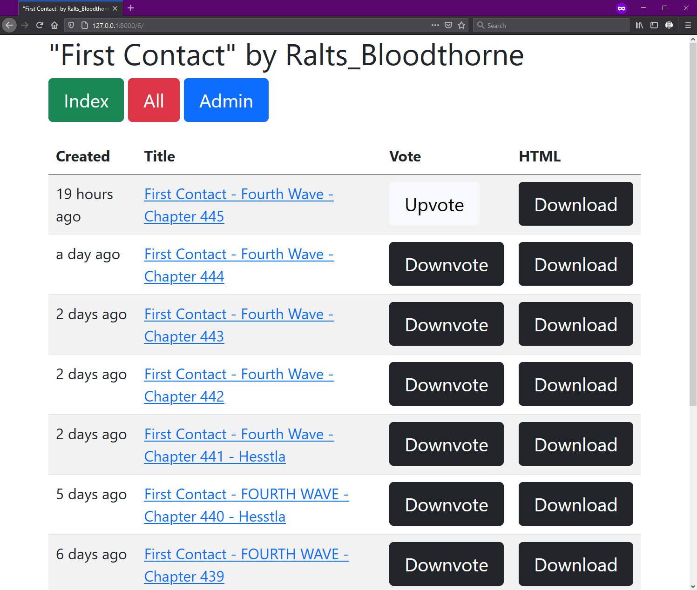

# redditSub2Kindle

redditSub2Kindle is my first django app.

It lets you subscribe to series being posted on reddit.

It's made with the assumption that a "story" has a common "title fragment" in each post title.

You are able to add multiple stories per username and the title fragment can even be a regular expression.

Good example subscription:
- Author: `Ralts_Bloodthorne`
- Subreddit: `HFY`
- Title Fragment: `First Contact`
- Is Regex: `False`
- Enabled: `True`

# Setup

Configure praw, I left an example config and praw_auth.py

# TODO

- Make a user system, gate the front page with user authentication/registration (register with reddit auth?)
- Make it possible to link your user to your reddit account yourself (or oauth)
- Make it possible to register authors and or subscriptions without using the admin panel
- Function with a registered but unlinked user (no upvoting/hiding/seeing state) (no oauth?)
- Make a background process fetch author posts and store them locally for users
- Notification support? Email support? or reddit message maybe?
- Enqueue a direct url to later download/upvote/remove on Kindle

# Screenshots

This is what the index page looks like

And here is a single subscription page

And this is the all subscriptions page

